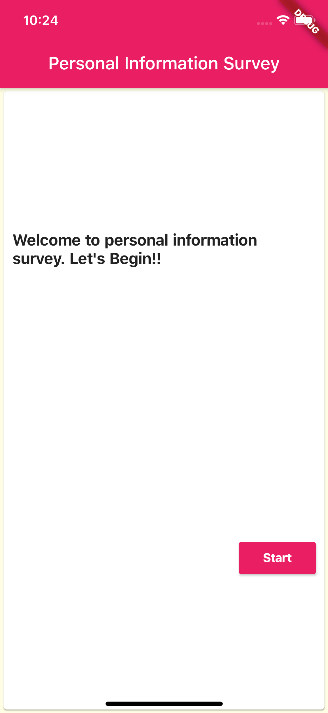
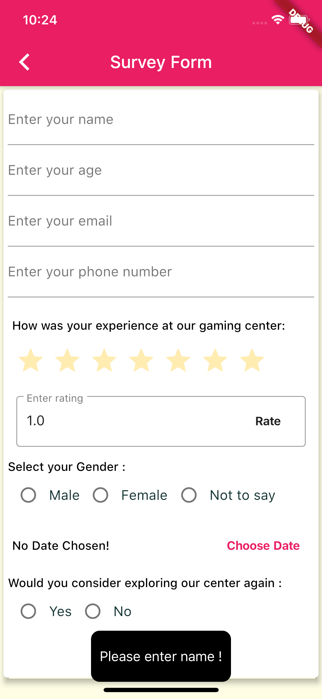
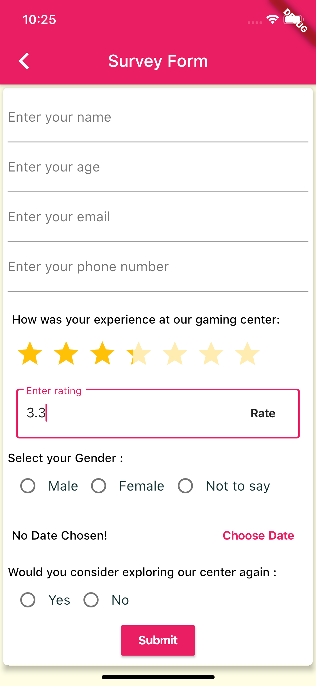
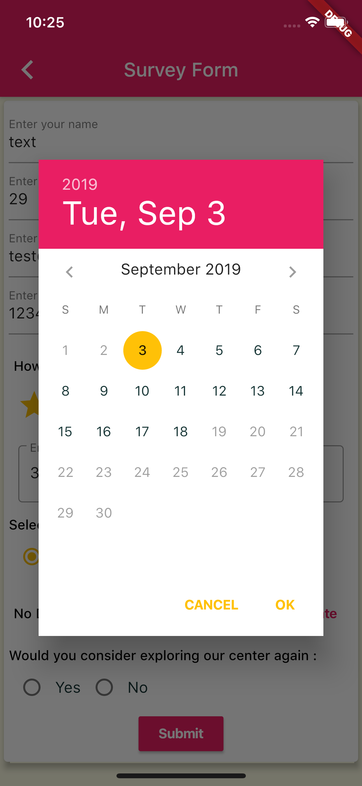
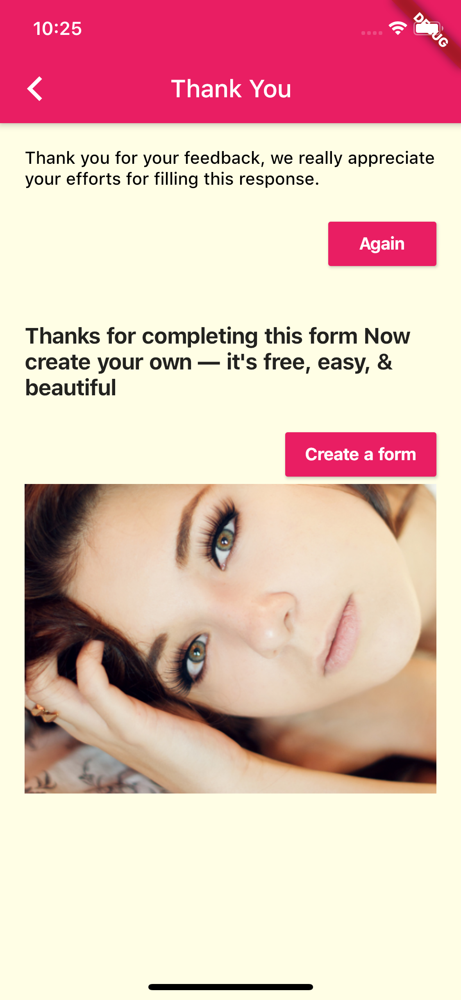

# atlan

** A new Flutter project with State management using Bloc and offline data storage using sqflite.
** For api parsing used rxdart package.

## Getting Started

##Dependencies
>###State Management use anyone library betweeb Bloc and provider
```
 provider: ^3.1.0 -> for state management optional
 bloc: ^0.15.0 -> for state management optional
 flutter_bloc: ^0.21.0 -> it works with combination of bloc
   
 ```
 
>Database 
```
  sqflite: ^1.1.6+4 -> for flutter offline database
  path_provider: ^1.2.0 -> for database path

```
>Date Time
```
  intl: ^0.16.0 -> for DateFormat
  
```

>Rating Bar
```
  flutter_rating_bar: ^2.0.0+2 -> Used for rating bar
```
>Toast Message
```
  fluttertoast: ^3.1.2 -> Used for Toast Message
```
> API Parsing
```
  rxdart: ^0.22.2 -> used for API parsing
  http: ^0.12.0+2 -> used for http/https request  
```
  
### App Screenshots









